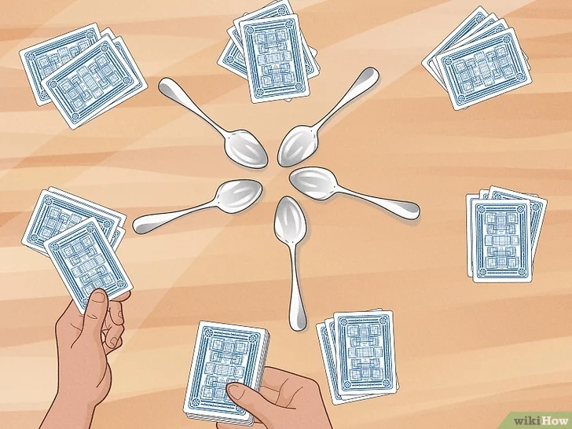

## Cardgame: Spoons
This is a basic CLI model for the cardgame spoons, which works by having a set number of players who are distributed cards to their hands and individual decks. They then play by picking up from the player to their rights deck and discarding to the player to their lefts deck. The winner is the first player holding only one type of card denomination.

### Set up and dependencies
To run the model please have:
    1. Java working and functional on your IDE of choice or Computer
    2. A test file in text format
*IMPORTANT*
>The test file must be placed in the folder containing the Cardgame.java file, the number of cards it should have should be 8 times the number of players, and it should be formatted like the example 'location.txt' file in the folder
Should there be any error at the user end in the input, the script will throw the applicable error to be evaluated and acted on.

### Usage
To start the model, run the Cardgame.java file and follow the prompts in the CLI. 
Enter the number of players, and the name of your text file.
After this the script will run the model.

Each player will be started as a thread, picking up and putting down, until one wins, at which point the game will end.

---
### Known Issues
This model is not perfect. It accommodates for a large number of exceptions and handles them, but it is intended for small scale models with fewer players and cards.
It addresses, but does not solve, problems like:
 - incorrect placement of text files in the wrong directories
 - pointing to a file that does not exist
 - having the wrong number of elements in the input file
This program does not generate elements or make decisions about the number of players for you, it just works with what you give it. 