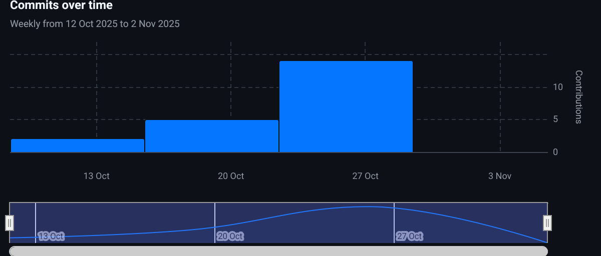

## Report
Cardgame: By Zachary Fenton and Sebastian Leach

---
### Introduction
Fundamentally, the logic of how the game works is not that complicated, the challenge is presented in implementing new Java ideas and frameworks from lectures, and creating an efficient and functional backend. Our aim in this coursework was to use as much of the information in lectures as possible to make this project, and to make it functional and efficient.

#### Approach and design decisions
To begin with, we used the 'Navigator and driver' methodology to divide up our work. I (Sebastian Leach) acted as the navigator to begin with, laying out the structure and plan for our project, while Zachary coded the basics. As the project continued, we both took turns in each role, Zachary primarily coding the PlayerList and threads while I navigated, and I programmed the getting input and Player while Zachary navigated. 

Very quickly, we decided to use `arrays` as opposed to ArrayLists to store our values, as the nature of the program meant the size was predetermined, and arrays offered lower latency and quicker handling of int variables. While not a signficant difference in optimisation, for large data sets and numbers of players, the distinction would grow obvious.

We also were intentional in handling as many exceptions as possible, from input for the number of players being of the wrong type or in an impossible range (less than 2), to adding ".txt" to file location inputs if the user had forgotten to.

---

#### Challenges
We made it a priority to use nested loops, to use what was taught in lectures,some of which would extend the Thread class to fulfill the project requirements. This presented us with our first real challenge. It took a few hours of debugging and logic to understand properly how to instansiate variables, reference methods and actually implement the parent and child classes. The result was that we were very explicit in structuring our program so that it was visually obvious what did what.

We also faced the problem of working on the same codespace as covered in the lecture on Virtual Environments. We found that often we would push and pull in a way that created forks, that we would have to carefully merge not to cause loss of code. The result of this was that by the end, we kept redundent copies of the codespace in case the live codespace ever failed.

Finally we were presented with one last problem when dealing with how decks would act, finding it increasingly difficult to as we progressed to use the arrays we had created for the decks as attributes of the players. It took rewriting the program to include a dedicated class for Decks for us finally to be successful.

---

### Conclusion
This coursework instructive in helping understand how to use threads, and how they might actually be useful for concurrent acions, as well as presenting issues like Livelock, Deadlock and starvation.
It improved our testing methods and debugging, teaching us the hard way the exponential time cost of debugging code later in development, and was very instructive in how to work cooperatively as a pair.

